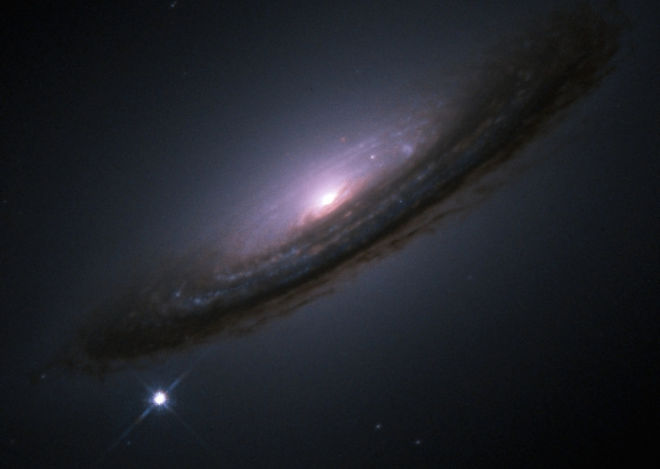

---
jupyter:
  jupytext:
    split_at_heading: true
    text_representation:
      extension: .Rmd
      format_name: rmarkdown
      format_version: '1.1'
      jupytext_version: 1.2.4
  kernelspec:
    display_name: Python 3
    language: python
    name: python3
---

# The Age of the Universe

This exercise is from the Summer 2017 [Berkeley course
materials](https://github.com/data-8/data8assets) with thanks.

Sometimes, the primary purpose of regression analysis is to learn something about the slope or intercept of the best-fitting line.  When we use a sample of data to estimate the slope or intercept, our estimate is subject to random error, just as in the simpler case of the mean of a random sample.

In this lab, we'll use regression to get an accurate estimate for the age of the universe, using pictures of exploding stars.  Our estimate will come from a sample of all exploding stars. We'll compute a confidence interval to quantify the error caused by sampling.

```{python}
# Run this cell, but please don't change it.

# These lines import the Numpy and Pandas modules.
import numpy as np
import pandas as pd

# Stardard plotting setup.
import matplotlib
# %matplotlib inline
import matplotlib.pyplot as plt
plt.style.use('fivethirtyeight')

# Fancy stuff for some interactive plots
import warnings
# warnings.simplefilter('ignore', FutureWarning)
from matplotlib import patches
from ipywidgets import interact, interactive, fixed
import ipywidgets as widgets

# These lines load the tests.
from client.api.notebook import Notebook
ok = Notebook('time_slopes.ok')
```


<!-- #region -->

## The Actual Big Bang Theory

In the early 20th century, the most popular cosmological theory suggested that
the universe had always existed at a fixed size.  Today, the Big Bang theory
prevails: Our universe started out very small and is still expanding.

A consequence of this is Hubble's Law, which says that the expansion of the
universe creates the appearance that every celestial object that's reasonably
far away from Earth (for example, another galaxy) is moving away from us at
a constant speed.  If we extrapolate that motion backwards to the time when
everything in the universe was in the same place, that time is (roughly) the
beginning of the universe!

Scientists have used this fact, along with measurements of the current
*location* and *movement speed* of other celestial objects, to estimate when
the universe started.

The cell below simulates a universe in which our sun is the center and every
other star is moving away from us.  Each star starts at the same place as the
sun, then moves away from it over time.  Different stars have different
directions *and speeds*; the arrows indicate the direction and speed of travel.

Run the cell, then move the slider to see how things change over time.

<!-- #endregion -->

```{python}
# Just run this cell.  (The simulation is actually not
# that complicated; it just takes a lot of code to draw
# everything.  So you don't need to read this unless you
# have time and are curious about more advanced plotting.)

num_locations = 15
eg_x = np.random.normal(size=num_locations)
eg_y = np.random.normal(size=num_locations)
start_of_time = -2

def scatter_after_time(t, start_of_time, end_of_time, x, y, center_name,
                       other_point_name, make_title):
    max_location = (
        1.1 * (end_of_time - start_of_time) * np.max(np.abs(np.append(x, y)))
    )
    new_x = (t - start_of_time) * x
    new_y = (t - start_of_time) * y
    n = len(x)
    plt.scatter([0], [0], label=center_name, s=100, c="yellow")
    plt.scatter(new_x, new_y, label=other_point_name)
    for i in np.arange(n):
        plt.arrow(
            new_x[i],
            new_y[i],
            x[i],
            y[i],
            fc='black',
            ec='black',
            head_width=0.025 * max_location,
            lw=.15)
    plt.xlim(-max_location, max_location)
    plt.ylim(-max_location, max_location)
    plt.gca().set_aspect('equal', adjustable='box')
    plt.gca().set_position(make_array(0, 0, 1, 1))
    plt.legend(bbox_to_anchor=(1.6, .7))
    plt.title(make_title(t))
    plt.show()

interact(
    scatter_after_time,
    t=widgets.FloatSlider(min=start_of_time, max=5, step=.05, value=0,
                          msg_throttle=1),
    start_of_time=fixed(start_of_time),
    end_of_time=fixed(5),
    x=fixed(eg_x),
    y=fixed(eg_y),
    center_name=fixed("our sun"),
    other_point_name=fixed("other star"),
    make_title=fixed(lambda t: "The world {:01g} year{} in the {}".format(abs(t), "" if abs(t) == 1 else "s", "past" if t < 0 else "future"))
);
```

### Question 1

When did the universe start, in this example?


*Write your answer here, replacing this text.*


### Question 2

After 5 years (with the slider all the way to the right), stars with longer
arrows are further away from the Sun.  Why?


*Write your answer here, replacing this text.*


### Analogy: driving

Here's an analogy to illustrate how scientists use information about stars to
estimate the age of the universe.

Suppose that at some point in the past, our friend Mei started driving in a car
going at a steady speed of 60 miles per hour straight east.  We're still
standing where she started.

```{python}
# Run this cell to see a picture of Mei's locations over time.
mei_x = np.array([60])
mei_y = np.array([0])

interact(
    scatter_after_time,
    t=widgets.FloatSlider(min=-2, max=1, step=.05, value=0, msg_throttle=1),
    start_of_time=fixed(-2),
    end_of_time=fixed(1),
    x=fixed(mei_x),
    y=fixed(mei_y),
    center_name=fixed("Us"),
    other_point_name=fixed("Mei"),
    make_title=fixed(lambda t: "Mei's position {:01g} hour{} in the {}".format(abs(t), "" if abs(t) == 1 else "s", "past" if t < 0 else "future")));
```

We want to know how long she's been driving, but we forgot to record the time
when she left.  If we find out that she's 120 miles away, and she's been going
60 miles per hour the whole time, we can infer that she left 2 hours ago.

One way we can compute that number is by fitting a line to a scatter plot of
our locations and speeds.  It turns out that the *slope* of that line is the
amount of time that has passed.  Run the next cell to see a picture:

```{python}
# Just run this cell.
mei_speed = 60
mei_distance = 120
# Add origin and Mei points
plt.plot([0, mei_speed], [0, mei_distance], 'o')
# Draw a line between them
plt.plot([0, mei_speed], [0, mei_distance], ':')
# Label points
plt.text(0, 10, 'Us', fontsize=20)
plt.text(mei_speed + 2, mei_distance + 2, 'Mei', fontsize=20)
plt.text(mei_speed / 2 + 2, mei_distance / 2 - 4, 'Slope = 2 hours', color='blue', fontsize=20)
# Label axes
plt.xlabel("Speed moving away from us (miles per hour)")
plt.ylabel("Current distance from us (miles)");
```

The slope of the line is 2 hours.  (The units are vertical-axis units divided
by horizontal-axis units, which are $\frac{\texttt{miles}}{\texttt{miles} /
\texttt{hour}}$, or hours.)  So that's our answer.

Imagine that you don't know Mei's *exact* distance or speed, only rough
estimates.  Then if you drew this line, you'd get a slightly bad estimate of
the time since she left.  But if you measured the distance and speed of
hundreds of people who left you at the same time going different speeds, and
drew a line through them, the slope of that line would be a pretty good
estimate of the time they left, even if the individual measurements weren't
exactly right.

The `drivers.csv` dataset contains the speeds and distances-from-start of 100
drivers.  They all left the same starting location at the same time, driving at
a fixed speed on a straight line away from the start.  The measurements aren't
exact, so they don't fit exactly on a line.  We've created a scatter plot and
drawn a line through the data.

```{python}
# Just run this cell.
drivers = pd.read_csv('drivers.csv')
drivers.plot.scatter(x=0, y=1)  # Plot second column against first.
# Draw a well-fitting line through the points.
plt.plot([5, 75], [8.3333, 125], color='black')
```

### Question 3

By *looking at the fit line*, estimate how long ago (in hours) this cohort of
drivers left.

```{python}
#- Fill in the start time you infer from the above line.
#<- driving_start_time_hours = ...
driving_start_time_hours = 15/9
#<--
driving_start_time_hours
```

```{python}
_ = ok.grade('q3')
```

### Back to cosmology

To do the same thing for the universe, we need to know the distance-from-Earth
and speed-away-from-Earth of many celestial objects.  Using pictures taken by
very accurate telescopes and a lot of physics, astronomers have been able to
estimate both.  It turns out that *nearby supernovae* -- stars that have
recently died and exploded -- are among the best sources of this data, because
they are very easy to see.  This picture taken by the Hubble telescope shows an
entire galaxy, with a single supernova - as bright by itself as billions of
stars - at the bottom left.



Our astronomical data for today will come from the [Supernova Cosmology
Project](http://supernova.lbl.gov/union/) at Lawrence Berkeley Lab.  The
original dataset is
[here](http://supernova.lbl.gov/union/figures/SCPUnion2.1_mu_vs_z.txt), with
(brief) documentation
[here](http://supernova.lbl.gov/union/descriptions.html#Magvsz).  Each row in
the table corresponds to a supernova near Earth that was observed by
astronomers.  From pictures like the one above, the astronomers deduced how far
away each supernova was from Earth and how fast it was moving away from Earth.
Their deductions were good, but not perfect.

Run the cell below to load the data into a table called `close_novas` and make a scatter plot.

```{python}
# Just run this cell.
close_novas = pd.read_csv("close_novas.csv")
close_novas.plot.scatter(0, 1)
```

```{python}
# Show the first five rows.
close_novas.head()
```

### Question 4

Looking this plot, make a guess at the age of the universe.

**Note**: Make sure you get the units right!  In case you need to know what a
parsec is, it's a big unit of distance, equivalent to 30.86 trillion
kilometers.

```{python}
#- Fill this in manually by examining the line above.
#<- first_guess_universe_age_years = ...
first_guess_universe_age_years = 1.5 * 10**10

# This just shows your guess as a nice string, in billions of years.
"{:,} billion years".format(round(first_guess_universe_age_years / 1e9, 2))
```

```{python}
_ = ok.grade('q4')
```

### Fitting the line yourself

We would like to be able to calculate the best slope rather than estimating by
eye.  Recall that the least-squares regression line for our supernova data is:

* the line
* with the smallest average (over all the supernovae we observe)
* error,
* squared,
* where the error is

$$\text{the supernova's actual distance from Earth} - \text{the height of the
line at that supernova's speed.}$$


### Question 5

Define a function called `errors`.  It should take three arguments:

1.  a table like `close_novas` (with the same column names and meanings, but
    not necessarily the same data)
2.  the slope of a line (a number)
3.  the intercept of a line (a number).

It should return an array of the errors made when a line with that slope and
intercept is used to predict distance from speed for each supernova in the
given table.  (The error is the actual distance minus the predicted distance.)

```{python for_assignment_type=student}
#<--
def errors(tbl, slope):
#<-     ...
#<-     return ...
    fit = tbl["Speed (parsecs/year)"] * slope
    return tbl["Distance (million parsecs)"] - fit
```

### Question 6

Using `errors`, compute the errors for the line with slope `16000` and
intercept `0` on the `close_novas` dataset.  Name that array `example_errors`.
Then make a scatter plot of the errors.

**Hint:** To make a scatter plot of the errors, plot the error for each
supernova in the dataset.  Put the actual speed on the horizontal axis and the
error on the vertical axis.

```{python}
#<- example_errors = ...
#<- ...
example_errors = errors(close_novas, 16000)
```

```{python}
_ = ok.grade('q6')
```

You should find that the errors are almost all negative.  That means our line
is a little bit too steep.  Let's find a better one.


### Question 7

Define a function called `fit_line`.  It should take a table like `close_novas`
(with the same column names and meanings) as its argument.  It should return an
array containing the slope (as item 0) and intercept (as item 1) of the
least-squares regression line predicting distance from speed for that table.

Note: If you haven't tried to use the `minimize` function yet, now is a great
time to practice. Here's an [example from the textbook]({{ site.baseurl
}}/chapters/08/mean_and_slopes).

```{python}
from scipy.optimize import minimize
#<--
def fit_line(tbl):
    #- Your code may need more than 1 line below here.
#<-    def mse(..., ...):
#<-        ...
#<-    return ...
    def mse(slope):
        return np.mean(errors(tbl, slope) ** 2)

    return minimize(mse, 16000).x[0]


# Here is an example call to your function.  To test your function,
# figure out the right slope and intercept by hand.
example_table = pd.DataFrame()
example_table["Speed (parsecs/year)"] = np.array([0, 1])
example_table["Distance (million parsecs)"] = np.array([0, 3])
fit_line(example_table)
```

```{python}
_ = ok.grade('q7')
```

### Question 8

Use your function to fit a line to `close_novas`.

Then, set `new_errors` equal to the errors that we get calling `errors` with
our new line. The following line will graph the corresponding residual plot
with a best fit line.

Make sure that the residual plot makes sense.

*Hint*: what qualities should the best fit line of a residual plot have?

```{python}
#<- best_line_slope = ...
#<- best_line_intercept = ...
#<- 
#<- new_errors = ...
best_fit_slope = fit_line(close_novas)
new_errors = errors(close_novas, best_fit_slope)

# This code displays the residual plot, given your values for the
# best_line_slope and best_line_intercept
error_df = pd.DataFrame()
error_df["Speed (parsecs/year)"] = close_novas['Speed (parsecs/year)'].copy()
error_df["Distance errors (million parsecs)"] = new_errors
error_df.plot.scatter(0, 1)

# This just shows your answer as a nice string, in billions of years.
f"Slope: {best_fit_slope:g} (corresponding to an estimated age of {best_fit_slope/1000:.4f} billion years)"
```

That slope (multiplied by 1 million) is an estimate of the age of the universe.
The current best estimate of the age of the universe (using slightly more
sophisticated techniques) is 13.799 billion years.  Did we get close?


Nice work, data astronomer! You can compare your result to the [Planck project
2015 results](https://arxiv.org/pdf/1502.01589.pdf), which estimated the age of
the universe to be 13.799±0.021 billion years.


## Done

You're finished with the assignment!  Be sure to...

- **run all the tests** (the next cell has a shortcut for that),
- **Save and Checkpoint** from the "File" menu.
- Finally, **restart** the kernel for this notebook, and **run all the cells**,
  to check that the notebook still works without errors.  Use the
  "Kernel" menu, and choose "Restart and run all".  If you find any
  problems, go back and fix them, save the notebook, and restart / run
  all again, before submitting.  When you do this, you make sure that
  we, your humble markers, will be able to mark your notebook.

```{python}
# For your convenience, you can run this cell to run all the tests at once!
import os
_ = [ok.grade(q[:-3]) for q in os.listdir("tests") if q.startswith('q')]
```
